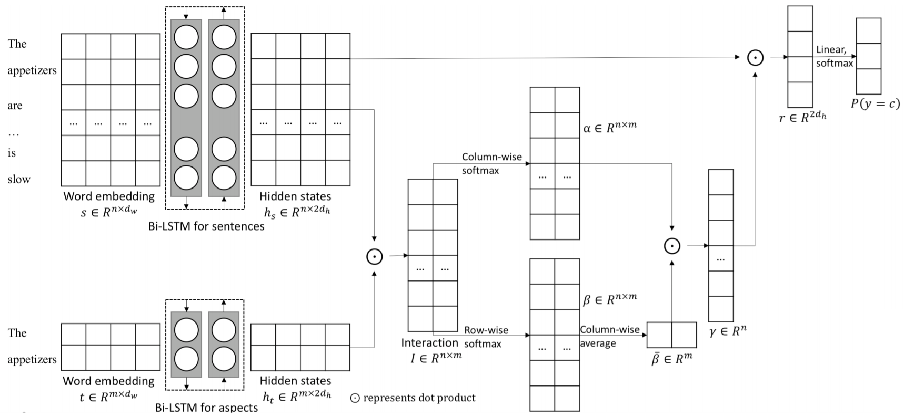

# Aspect-Level Sentiment Analysis Task, CCF BDCI Contest

Classify car-related user comments on automobile forum to four sentiment polarities for ten aspects.

Evaluation metric is a slightly modified F1 score.

See [model notebook](https://github.com/idorce/sentiment-analysis-ccf-bdci/blob/master/aspectSenti.ipynb) for more detail.

## File description

| Filename           | Description                         |
| -                  | -                                   |
| [aspectSenti.ipynb](https://github.com/idorce/sentiment-analysis-ccf-bdci/blob/master/aspectSenti.ipynb)  | BLSTM model with attention          |
| [getEmbedding.ipynb](https://github.com/idorce/sentiment-analysis-ccf-bdci/blob/master/getEmbedding.ipynb)  | Get word embedding                  |
| modelHuangEtAl.PNG | Model architecture of Huang et al.  |
| train.csv          | Training data                       |
| test_public.csv    | Sentences to predict for submission |

## Model description

The BLSTM model with attention is inspired by [Huang et al.](https://arxiv.org/abs/1804.06536) (shown below) but different from it.

Some differences are:
1. All aspects (target) in this problem are of one word, so there is only column-wise softmax or common attention mechanism. The attention-over-attention mechanism in that paper is not applied here.
2. A **Lambda layer** inputs all targets into the network at once for each sentence, which reduces training time and strengthens connections among all aspects.
3. Post-attention sentence representations for all aspects are **flattened** to predict 40 classes together, which further strengthens connections among all aspects.
4. Predicting section is not just a single fully connected layer, which enhances network's expressivity.
5. ...

See [model notebook](https://github.com/idorce/sentiment-analysis-ccf-bdci/blob/master/aspectSenti.ipynb) with architecture visialization for more detail.

## Ranking

Team nickname: ChickenDinner.

|2018      |     |Public Leaderboard|Private Leaderboard|
|-       |-   |- |- |
|08.28 -> 10.21 | Preliminary |7 |20|
|10.26 -> 11.11 | Final      |12|17|

#teams participated: 1701.

We ensembled four or five models, and the one demonstrated here scores the highest (single model 0.676, 18th on the final public leaderboard) among them.

## Others

In case Github is sometimes not rendering jupyter notebook, view on [nbviewer](https://nbviewer.jupyter.org/github/idorce/sentiment-analysis-ccf-bdci/tree/master/).

Notebooks were run on [Google Colab](https://colab.research.google.com/).
